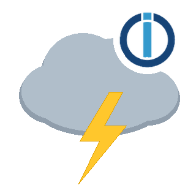

# ioBroker.blitzwarnung

[](https://www.npmjs.com/package/iobroker.blitzwarnung)
[](https://www.npmjs.com/package/iobroker.blitzwarnung)


**Tests:** 

## Gewitter-/Blitzwarnung ueber Blitzortung.org

Dieser Adapter verbindet sich mit dem kostenlosen Live-Feed von [Blitzortung.org](https://www.blitzortung.org/)
(einem Community-Blitzortungsnetzwerk) und meldet erkannte Blitzeinschlaege in der Naehe deiner Wohnung -
optional zusaetzlich in der Naehe eines aktuellen Standorts (z.B. per Handy-GPS/MacroDroid).

Es gibt zwei Warnstufen:
* **Hinweis** - Blitz im weiteren Umkreis (Standard 20 km)
* **Warnung** - Blitz ganz in der Naehe (Standard 5 km)

Meldungen werden per **Telegram** verschickt. Fuer die Warnstufe kann zusaetzlich **Pushover** mit
"Emergency"-Prioritaet genutzt werden - das durchdringt auch den Stumm-/Nicht-stoeren-Modus des Handys
und wiederholt sich, bis man die Meldung bestaetigt.

### Voraussetzungen
* Ein eingerichteter [Telegram-Adapter](https://github.com/iobroker-community-adapters/ioBroker.telegram) (fuer Benachrichtigungen)
* Optional: ein eingerichteter [Pushover-Adapter](https://github.com/ioBroker/ioBroker.pushover) (fuer die dringliche Warnstufe)
* Optional: zwei States mit dem aktuellen Standort (Breiten-/Laengengrad), z.B. per MacroDroid/Handy-GPS, wenn
  die zusaetzliche Standort-Ueberwachung genutzt werden soll

### Konfiguration
* **Standort (Wohnung)** - Breiten-/Laengengrad deiner Wohnung. `0 / 0` uebernimmt automatisch den
  ioBroker-Systemstandort (den, der auch fuer Sonnenauf-/untergang genutzt wird).
* **Warnstufen** - Radien fuer Hinweis/Warnung, Cooldown zwischen Meldungen gleicher Stufe, nach welcher
  Ruhezeit ein neues Ereignis beginnt, wie alt ein Blitz maximal sein darf, und wann die Statistik-States
  zurueckgesetzt werden.
* **Telegram** - an/aus, Telegram-Instanz, State mit dem Telegram-Empfaenger (Username).
* **Pushover (optional, nur Warnstufe)** - an/aus, Pushover-Instanz, Wiederholungs-/Timeout-Zeiten fuer die
  Emergency-Prioritaet.
* **Aktueller Standort (optional)** - an/aus, States mit Breiten-/Laengengrad des aktuellen Standorts, ab
  welcher Entfernung von der Wohnung man als "unterwegs" gilt, und wie alt der Standort maximal sein darf.
* **Verbindung (erweitert)** - Reconnect-Wartezeit, Heartbeat-Intervall, Debug-Zusammenfassungs-Intervall.

### States
| State | Beschreibung |
|-------|--------------|
| `info.connection` | Verbindung zu Blitzortung.org steht |
| `home.level` | Aktuelle Warnstufe fuer die Wohnung (0 = ruhig, 1 = Hinweis, 2 = Warnung) |
| `home.distanceKm` | Entfernung des letzten relevanten Blitzes zur Wohnung (km) |
| `home.distanceText` | Dieselbe Entfernung als fertiger Text, z.B. fuer VIS (inkl. Text ohne aktuelles Gewitter) |
| `home.lightningCountToday` | Anzahl relevanter Blitze seit Mitternacht im Umkreis der Wohnung |
| `phone.away` | Ob der aktuelle Standort gerade als "unterwegs" gilt |
| `phone.level` | Aktuelle Warnstufe fuer den aktuellen Standort |
| `phone.distanceKm` | Entfernung des letzten relevanten Blitzes zum aktuellen Standort (km) |

### Installation
Der Adapter ist (noch) nicht im offiziellen ioBroker-Repository gelistet. Installation erfolgt ueber die
Admin-Oberflaeche (Adapter-Reiter -> GitHub-Icon -> "Benutzerdefiniert") oder per Kommandozeile:
```bash
iobroker url https://github.com/Groej77/ioBroker.blitzwarnung
```
Derselbe Weg funktioniert auch fuer spaetere Updates, nachdem Aenderungen ins Repository gepusht wurden.

## Changelog
<!--
    Placeholder for the next version (at the beginning of the line):
    ### **WORK IN PROGRESS**
-->

### **WORK IN PROGRESS**

### 0.0.2 (2026-09-20)
* (Groej77) Neues Adapter-Icon (Wolke mit Blitz statt Zauberer)

### 0.0.1 (2026-09-20)
* (Groej77) initial release

## License
MIT License

Copyright (c) 2026 groej77 <groej77@gmx.de>

Permission is hereby granted, free of charge, to any person obtaining a copy
of this software and associated documentation files (the "Software"), to deal
in the Software without restriction, including without limitation the rights
to use, copy, modify, merge, publish, distribute, sublicense, and/or sell
copies of the Software, and to permit persons to whom the Software is
furnished to do so, subject to the following conditions:

The above copyright notice and this permission notice shall be included in all
copies or substantial portions of the Software.

THE SOFTWARE IS PROVIDED "AS IS", WITHOUT WARRANTY OF ANY KIND, EXPRESS OR
IMPLIED, INCLUDING BUT NOT LIMITED TO THE WARRANTIES OF MERCHANTABILITY,
FITNESS FOR A PARTICULAR PURPOSE AND NONINFRINGEMENT. IN NO EVENT SHALL THE
AUTHORS OR COPYRIGHT HOLDERS BE LIABLE FOR ANY CLAIM, DAMAGES OR OTHER
LIABILITY, WHETHER IN AN ACTION OF CONTRACT, TORT OR OTHERWISE, ARISING FROM,
OUT OF OR IN CONNECTION WITH THE SOFTWARE OR THE USE OR OTHER DEALINGS IN THE
SOFTWARE.
